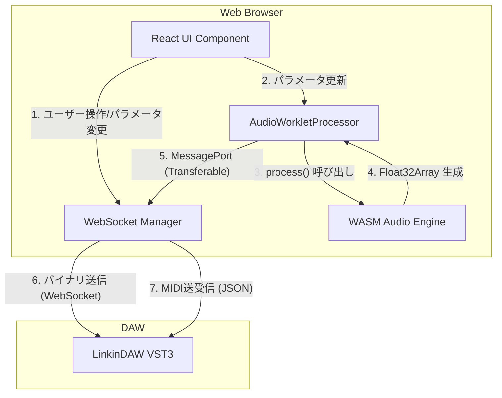

# WASM Web Application 基本設計案 (Vite + React)

C++プラグインのビルド確認と並行して、WASMとReactを用いたWebアプリケーション側のアーキテクチャ設計案を提示します。

## 1. 全体アーキテクチャ概要

WASM（AudioWorklet）でオーディオを生成し、それをWebSocket経由でDAWへストリーミングする構成です。



## 2. AudioWorklet と WebSocket の制約と解決策
**【重要事項】** `AudioWorkletGlobalScope`（Worklet内のスレッド）では、直接 `WebSocket` API を呼び出すことができません。

そのため、以下のデータフローを構築します：
1. **AudioWorkletProcessor** が WASM を駆動して 128 サンプルの `Float32Array` を生成。
2. 生成した配列を `port.postMessage(buffer, [buffer])` を使って **Transferable Objects** としてメインスレッド（または専用のWeb Worker）へゼロコピー転送する。
   *※より高度な実装では `SharedArrayBuffer` を用いたリングバッファを使いますが、ローカル検証の初期段階ではTransferable Objectsで十分なパフォーマンスが出ます。*
3. **メインスレッド (WebSocket Manager)** が受け取ったバイナリを `ws.send(buffer)` で LinkinDAW へ送信。

## 3. WASM モジュール (C/C++ -> Emscripten)
テスト用のシンプルなオシレーター（または非サンプリング・ドラムモジュール）をC++で記述し、Emscriptenでコンパイルします。

**WASM (C++) のインターフェース想定:**
```cpp
extern "C" {
    // 状態の初期化
    void init(float sampleRate);
    
    // 発音トリガー（MIDI Note On相当）
    void noteOn(int note, int velocity);
    
    // 128サンプルのバッファを生成してポインタを返す
    float* process(); 
}
```
JavaScript側からは `Module.ccall` や `WebAssembly.Instance.exports` を介してこれらを呼び出し、C++側のヒープメモリから `Float32Array` のビューを作成します。

## 4. プロジェクト構成と技術スタック
- **ビルドツール:** Vite
- **フレームワーク:** React (TypeScript)
- **WASMビルド:** Emscripten (C++ -> WASM)
- **主要なディレクトリ構成:**
  ```text
  WebApp/
  ├── src/
  │   ├── App.tsx             # メインUI（接続状態、パラメータノブ）
  │   ├── audio/
  │   │   ├── worklet.ts      # AudioWorkletProcessorの実装
  │   │   └── wasm/           # C++ソースとコンパイル済み.wasm
  │   └── network/
  │       └── Socket.ts       # WebSocketの接続管理・送信ロジック
  └── vite.config.ts
  ```

---
このアーキテクチャに基づき、C++プラグインのビルドが成功した後に `Vite` プロジェクトの初期化と実装へ進む予定です。ご質問や追加のご要望はありますか？
